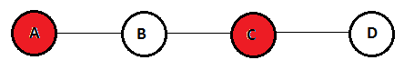

Rapport sur l'algorithme de calcul d'Ensemble dominant connexe minimal présenté dans l'article *On greedy construction of connected dominating sets in wireless networks* de Li, Thai, Wang, Yi, Wan, Du, Tong, Bin, Zao, Wun, Zhou, 2005 (1).

===

# Introduction
Un ensemble dominant d'un graphe *G* = (*S*, *A*) est un sous-ensemble *D* de *S* tel que pour toute arrête *uv* ∈ *A*, *u* ∈ *D* ou *v* ∈ *D*. Le problème consistant à trouver un ensemble dominant connexe de taille minimal (MCDS) est NP-Difficile. Dans ce rapport, nous étudierons l'algortihme *S-MIS* présenté dans *On greedy construction of connected dominating sets in wireless networks* de Li, Thai, Wang, Yi, Wan, Du, Tong, Bin, Zao, Wun, Zhou, 2005, qui propose un Schema d'approximation en temps polynomial (PTAS) donnant une *(4.8+ln(5))*-approximation de la solution optimale. Nous commenceront par présenter l'algorithme, puis présenteront les résultats expérimentaux obtenus, que nous compareront avec d'autres algorithmes de résolution de ce problème.  
Plus précisémment, nous étudieront cette algorithme dans le contexte des graphes géométriques. Ceux-ci sont composés d'un ensemble de sommets *S* et d'arrêtes *A* telles que *uv* ∈ *A* si et seulement si *distance(u,v)* ≤ *k*, *k* étant un seuil fixe. Nous présenteront également les générateurs aléatoires utilisés pour générer les graphes de tests.  

# Présentation de l'algorithme

L'algortihme *S-MIS* consiste en deux étapes : le calcul d'un *Maximum Independent Set* (MIS), puis le calcul du MCDS.  
Le papier présentant l'algorithme *S-MIS* ne présente pas d'algorithme permettant le calcul du MIS, mais suggère deux approches de calcul (2,3). Nous avons donc implémenté l'algorithme de Wan, Alzoubi et Frieder (3).

## 1- Calcul du MIS

Un ensemble indépendant dans un graphe *G* = (*S*, *A*) est un sous-ensemble *D* de *S* tel que pour tout *u* ∈ *D* et *v* ∈ *D*, *uv* ∉ *A*. Le problème de calculer un ensemble indépendant maximum est NP-difficile.  
Le MIS nécessaire au calcul du MCDS avec l'algorithme S-MIS doit de plus satisfaire une condition supplémentaire : pour tout *u* ∈ *D*, il doit exister *w* ∈ *S* tel qu'il existe *v* ∈ *D*, *v* ≠ *u* tel que *uw* ∈ *A* et *vw* ∈ *A*. Moins formellement, cela signifie qu'entre deux points apparetenant au MIS, il doit y avoir un et un seul point n'appartenant pas au MIS.

 
<i>Figure 1, un MIS valide comme base de l'algorithme S-MIS</i>

 

 
<i>Figure 2, un MIS invalide comme base de l'algorithme S-MIS</i>

Les figures 1 et 2 montrent toutes les deux des MIS : tous les sommets sont soit dans le MIS soit ont un voisin dans le MIS, et aucun sommet du MIS n'a de voisin dans le MIS. Cependant, dans le second, les deux sommets du MIS sont séparés d'une distance de deux sommets tandis qu'il ne sont séparés que d'un sommet dans le premier. Par conséquent, seule la figure 1 représente un MIS valide comme base de l'algorithme S-MIS.

## 2- Calcul du S-MIS

# Références

1. Yingshu Li, My T. Thai, Feng Wang, Chih-Wei Yi, Peng-Jun Wan and Ding-Zhu Du, On greedy construction of connected dominating sets in wireless networks, 2005.
2. Cadei M, Cheng MX, Cheng X, Du D-Z. Connected domination in ad hoc wireless networks. In Proceedings of the 6th International Conference on Computer Science and Informatics (CS&I’2002), Durham, NC, USA, March, 2002.
3. Wan P-J, Alzoubi KM, Frieder O. Distributed construction of connected dominating set in wireless ad hoc networks. In Proceedings of IEEE Infocom 2002, New York, NY, USA, June 2002.
