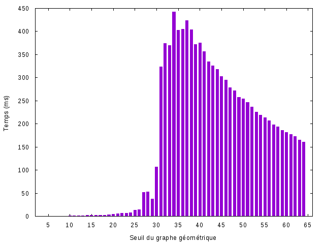

%Rapport sur l'algorithme de calcul d'Ensemble dominant connexe minimal présenté dans l'article *On greedy construction of connected dominating sets in wireless networks* de Li, Thai, Wang, Yi, Wan, Du, Tong, Bin, Zao, Wun, Zhou, 2005 (1).
%Darius Mercadier \and Jordi Bertran de Balanda

\newpage

# Introduction
Un ensemble dominant d'un graphe *G* = (*S*, *A*) est un sous-ensemble *D* de *S* tel que pour toute arrête *uv* $\in$ *A*, *u* $\in$ *D* ou *v* $\in$ *D*. Le problème consistant à trouver un ensemble dominant connexe de taille minimal (MCDS) est NP-Difficile. Dans ce rapport, nous étudierons l'algortihme *S-MIS* présenté dans *On greedy construction of connected dominating sets in wireless networks* de Li, Thai, Wang, Yi, Wan, Du, Tong, Bin, Zao, Wun, Zhou, 2005, qui propose un Schema d'approximation en temps polynomial (PTAS) donnant une *(4.8+ln(5))*-approximation de la solution optimale. Nous commenceront par présenter l'algorithme, puis présenteront les résultats expérimentaux obtenus, que nous compareront avec d'autres algorithmes de résolution de ce problème.

Plus précisémment, nous étudieront cette algorithme dans le contexte des graphes géométriques. Ceux-ci sont composés d'un ensemble de sommets *S* et d'arrêtes *A* telles que *uv* $\in$ *A* si et seulement si *distance(u,v)* $\leq$ *k*, *k* étant un seuil fixe. Nous présenteront également les générateurs aléatoires utilisés pour générer les graphes de tests.  


# Présentation de l'algorithme

L'algorithme *S-MIS* consiste en deux étapes : le calcul d'un *Maximum Independent Set* (MIS), puis le calcul du MCDS.

Le papier présentant l'algorithme *S-MIS* ne présente pas d'algorithme permettant le calcul du MIS, mais suggère deux approches de calcul (2,3). Nous avons donc implémenté l'algorithme de Wan, Alzoubi et Frieder (3).

## Calcul du MIS

Un ensemble indépendant dans un graphe *G* = (*S*, *A*) est un sous-ensemble *D* de *S* tel que pour tout *u* $\in$ *D* et *v* $\in$ *D*, *uv* $\notin$ *A*. Le problème de calculer un ensemble indépendant maximum est NP-difficile. C'est donc une $\alpha$-approximation que nous avons implémenté.  
Le MIS nécessaire au calcul du MCDS avec l'algorithme S-MIS doit de plus satisfaire une condition supplémentaire : pour tout *u* $\in$ *D*, il doit exister *w* $\in$ *S* tel qu'il existe *v* $\in$ *D*, *v* $\neq$ *u* tel que *uw* $\in$ *A* et *vw* $\in$ *A*. Moins formellement, cela signifie qu'entre deux points apparetenant au MIS, il doit y avoir un et un seul point n'appartenant pas au MIS.


Les figures 1 et 2 montrent toutes les deux des MIS : tous les sommets sont soit dans le MIS soit ont un voisin dans le MIS, et aucun sommet du MIS n'a de voisin dans le MIS. Cependant, dans le second, les deux sommets du MIS sont séparés d'une distance de deux sommets tandis qu'il ne sont séparés que d'un sommet dans le premier. Par conséquent, seule la figure 1 représente un MIS valide comme base de l'algorithme S-MIS.


### Implémentation de l'algorithme de calcul du MIS

L'algorithme utilisé pour calculer le MIS se base sur un système de couleur pour différencier les points non-visités (blancs) des points appartenant au MIS (noirs) et des points n'appartenant pas au MIS (bleus) : on part d'un point au hasard du graphe, que l'on marque noir (il est le premier point du MIS). On marque tous ses voisins bleus (il ne peuvent pas appartenir au MIS). Puis on ajoute les voisins des voisins qui sont encore blancs à la liste des points potentiellement dans le MIS. On retire le premier point de cette liste et on réitère le processus tant qu'il reste des points à examiner.

De manière plus pratique, le pseudo-code de cet algorithme est le suivant :  

    def MIS ( G = (V, E) ) :
	  MIS = []
	  for (p : V) :                     # Initializing the colors.
	    p.color = White
	  
	  Stack = [V.pop]
	  while (Stack.notEmpty) :
	    current = Stack.pop
		if (current.color == Blue) :    # Already covered
		  continue
		current.color = Black           # Adding it to the MIS
		MIS.add(current)
	    
		for (p : current.neighbors) :
		  p.color == Blue               # Marking the neighbors as covered
	  
	    for (p : current.neighbors) :
		  for (q : p.neighbors) :
		    if (q.color == White) :     # Adding the neighbors of the neighbors
			  Stack.add(q)              #  to the potential points of the MIS.
	
	  return MIS
	  
### Complexité du calcul du MIS

On note *n*=|*S*|, et *m*=|*E*|.  

__Initialisation__ :  
Initialiser les couleurs des sommets requière un unique parcours des sommets, en temps linéaire en la taille de *S* : `O(n)`.  
Pour des questions d'optimisation, on précalculera lors de l'initialisation une table d'association point-voisins qui a chaque point associera ses voisins. Cette opération est réalisable en `O(n^2)`), et permet de réaliser l'opération `neihbors` en `O(1)`.

__Boucle principale__ :  
Le pseudo-code précédemment donné est une version simplifié de l'algorithme réel pour des raisons de lisibilité, en particulier, dans une vrai implémentation un point n'est ajouté à la stack que si il n'y est pas déjà et si il est blanc. En tenant compte de cette condition, et en constatant qu'il y a autant d'itération de la boucle principale qu'il y a d'éléments qui sont ajoutés dans la stack lors de l'execution de l'algorithme, et vu qu'un sommet blanc enlevé de la Stack est marqué noir, on en conclue que le nombre d'itéreation de cette boucle est borné par *n*.  
On a expliqué précédemment que l'opération `neighbors` est réalisable en temps constant. Le nombre de voisins d'un points cependant est uniquement bornée par *m*. Par conséquent la boucle parcourant les voisins des voisins a une complexité en `O(m*m)`.  
La complexité de la boucle principale est donc `O(n*m*m)`.  

Il convient cependant de noter que dans les instances traitées, cette limite est une sur-approximation très large. En effet, les graphes étant géométriques, la distribution des sommets aléatoire et uniforme, et le seuil *k* très inférieur à la distance entre les extrèmes du domaine de définition des sommets, le nombre d'arrête par sommets sera très inférieur à *m*.  
Par conséquent, une complexité plus réaliste serait de l'ordre de `O(n*m)`. (Celà revient à supposer que le nombre d'arrêtes par sommets est de l'ordre de $\sqrt{m}$; ce chiffre dépend en réalité de la quantité de sommets, de l'air de la surface dans laquelle ils sont, et de l'uniformité de leur répartition. Dans nos test, le nombre d'arrêtes par sommets est en effet bien plus proche de $\sqrt{m}$ que de *m*).


## Calcul du S-MIS : algorithme de Li et al.

### Principe de l'algorithme
L'algorithme se base sur un Lemme inhérent à la manière dont le MIS est construit : il faut au maximum ajouter un point pour connecter deux points. (cf les figures 1 et 2).  
Informellement, à partir de ce Lemme, le principe de l'algorithme est de regrouper des clusters de sommets de manières greedy : on ajoute un à un les points qui permettent de regrouper le maximum de clusters.  
L'algorithme utilise un système de couleurs pour déterminer les points apartenant au MCDS car ils appartiennent au MIS (black) ou car on les y a rajoutés (blue), et ceux dont le status est encore à déterminer (grey). Les "clusters" de sommets à reliés sont appelés *black-blue component* (car ils sont induits par des points bleus et noirs conjoints, en ignorant les connexions entre sommets bleus). Afin de les relier, on trouve les sommets gris qui sont voisins du plus de points noirs de différents clusters possible (cette affirmation est légèrement inexacte car *du plus* est en réalité *5 ou plus*, puis *4*, puis *3*, *2* et finallement *1*, car en effet, tester toutes les possibilités reviendrait à rajouter un facteur *m* dans l'algorithme alors qu'en tester *5* ne fait qu'ajouter une constante). C'est cette partie de l'algorithme qui est greedy : on ajoute les points qui sur le moment semble aider au maximum a rendre le MIS connexe.

Le pseudo-code est le suivant :

```
# Params : MIS, the MIS obtained with the previously described method,
#          UDG, the graph from which the CDS should be returned.
	
def AlgorithmA (MIS, UDG) : 
  # Initialization
  for (p $\in$ MIS) :
    p.color = black
  for (p $\in$ UDG and p $\notin$ MIS) :
    p.color = grey
	
  # Main loop
  for (i in 5,4,3,2) :
    if ($\exists$ p $\in$ UDG | p.color = grey and p is adjacent to at least i black nodes in different black-blue compoments ) :
      # Then we choose p to connect those different black-blue components :
	  p.color = blue
	  
  return { p $\in$ UDG | p.color = blue }
	  
  # The S-SMIS is then: MIS $\cup$ AlgorithmA(MIS,UDG) 
```

### Analyse de la complexité


L'article de Li et al. ne donne pas d'indications quant aux structures de données à utiliser pour l'implémentation de l'algorithme. Par conséquent, la complexité de l'algorithme peut varier d'une implémentation à l'autre, notamment grace à des trade-off entre les consommations mémoire et temporelles. Dans l'analyse qui suit, nous essayeront donc de présenter à la fois la complexité d'une implémentation naïve, tout en mentionnant les optimisations et choix que nous avons fait.


#### Complexité spatiale

Premier point, toutes les opérations de l'algorithme se font *en place*, c'est à dire sans créer de nouvelles structures, mais uniquement en travaillant sur les couleurs des sommets. Par conséquent, l'espace mémoire nécessaire à cet algorithme est uniquement l'espace utilisé pour stocker le graphe, linéaire en le nombre de sommets.  
Même si velà n'est pas précisé par l'article, il faut prévoir de stocker les *black-blue components*. Ceux-ci contenant au maximum une fois chaque point, celà occupera un espace mémoire en $\mathcal{O}(n)$.  
De plus, quelques structures de données supplémentaires peuvent cependant s'avérer utiles, notamment une table d'association pour accéder aux voisins de chaque noeuds en temps moyen constant, mais l'espace occupé restera cependant en $\mathcal{O}(n)$.

#### Complexité temporelle

L'initialisation des couleurs se fait par un simple parcours du graphe, en $\mathcal{O}(n)$.  

Une étape importante de l'algorithme, qui n'est pas détaillée du tout par l'article de Li et al. est le calcul des *black-blue components*. Une implémentation naïve pourrait être de recalculer celles-ci à l'aide de parcours en profondeur du graphe (en suivant uniquement les liasons noir-bleu) à chaque fois qu'un noeud est noté bleu, ce qui entraine le regroupement de plusieurs *black-blue components*, avec une complexité de $\mathcal{O}(n+m)$. A noter que ce calcul se situe à l'intérieur d'une boucle en $\mathcal{O}(n)$ (nous reviendront sur la complexité de cette boucle juste après), donc celà donne une complexité de $\mathcal{O}(n*(n+m))$.  
Cependant, une version plus optimale consiste à uniquement regrouper les *black-blue components* lorsque l'ont ajoute un sommet bleu entre elles. Celà limite le coup lié au calcul de ces composantes à un unique $\mathcal{O}(n)$ à l'initialisation : au début, chaque point noir forme une *black blue component*.  
Il faut également tenir compte du nombre d'opérations nécessaire pour déterminer si un point est voisins de *x* sommets noirs appartenant à différentes *black-blue components*. En stockant ces composantes sous forme de liste de sommets, et la complexité en temps pour trouver les voisins noirs est $\mathcal{O}(n)$ car on est obligé de parcourir tous les points de toutes les composantes. On peut cependant ajouter à chaque noeud du graphe un attribut *component* pointant sur un objet *black-blue component*. Pour trouver les voisins noirs de différentes composantes, il suffit de parcourir les voisins du point ciblé, et de regarder leur couleur et la composante à laquelle ils appartiennent. Pour regrouper les composantes, il faut simplement updater objets *black-blue component* sur lesquels pointent les voisins noirs que l'on considérait (et cela mettra à jour la composante entière de chaque point, vu que tous les points d'une même composante ont leur attribut *component* qui pointent sur le même objet). Celà permet donc de baisser le coup de l'accès aux voisins appartenant à différentes *black-blue component* à $\mathcal{O}(m)$.  

La boucle principale de l'algorithme est effectuée cinq fois. Dedans, on va tester tous les points gris ($\mathcal{O}(n)$), et si ils ont plus de *i* voisins noirs de différentes *black-blue components* (calcul en $\mathcal{O}(m)$, comme on vient de le montrer), alors on change leur couleur. La compolexité de cette boucle est donc $\mathcal{O}(m*n)$.  

On a donc un $\mathcal{O}(n^2)$ pour l'initialisation des structures, puis $\mathcal{O}(n*m)$ pour la boucle principale. Or *m* $\leq$ *n*, donc la complexité temporelle de l'algorithme est donc $\mathcal{O}(n^2)$.


# Performances

## Méthode d'évalutation des performances

Les données obtenues dans cette section sont des moyennes du calcul de S-MIS sur des graphes générés
aléatoirement avec abscisses et ordonnées des points du graphe choisies uniformément. Nous prenons 500
échantillons par mesure pour pallier aux éventuels cas pathologiques de graphes, qui arrivent surtout 
avec des tailles de graphes faibles ($\leq$ 250 points).

Ceci a pour conséquence de créer un graphe bien moins 'centré' que ceux rendus disponibles par 
`supportGUI`. En conséquence l'évaluation est moins adaptée à des réseaux qui seraient centralisés 
autour d'un pôle.

Nous distinguons 3 paramètres sur les points en entrée qui peuvent influer sur la performance des 
algorithmes de calcul d'un ensemble dominant connexe.

1. La densité du nuage de points par rapport à leur fourchette d'abscisse et d'ordonnées
2. La valeur du seuil associé au graphe géométrique
3. La taille du nuage de points à traiter, à densité égale et seuil correspondant

Afin de ne pas causer de changement involontaire de l'un des paramètres lors de l'analyse d'un autre,
nous modifions les paramètres annexes.

## Taille du graphe géométrique

### Densité et forme du graphe

On cherche ici à examiner l'impact de la seule augmentation de la taille du graphe sur les performances
de l'algorithme. De manière à préserver le nombre moyen de voisins d'un noeud, on cherche à contrôler la
'densité' du graphe en variant les plages de valeurs d'abscisses et d'ordonnées disponible pour respecter:

$$ d = \frac{n}{r^2}$$

avec $d$ la densité du nuage de points, $n$ sa taille et $r$ la taille du carré 2D à l'intérieur duquel les
points sont générés aléatoirement.


Nous constatons ici que, à densité et connexité égales, l'algorithme est linéaire en la taille du nuage de
points en entrée. 

## Connexité du graphe géométrique

Nous évaluons ici l'impact de la connexité du graphe sur les performances de l'algorithme S-MIS.
À tailles de nuage de point égales, nous comparons les impacts de modifications de seuil du graphe
géométrique. Nous nous attendons à ce que la performance en temps de l'algorithme varie en de manière 
proportionnelle à ce seuil: intuitivement réduire la connexité du graphe réduit non seulement le
nombre de noeuds à traiter en rendant certains noeuds orphelins, mais aussi le nombre de composantes
indiquant les chemins connexes potentiels que l'algorithme impose de recalculer.



On remarque que le comportement de l'algorithme n'est pas, comme attendu monotone. On peut expliquer cela par la présence 
d'un seuil à partir duquel le nombre de voisins moyen devient suffisamment grand pour que le nombre de *black-blue components*
soit significativement réduit puisqu'un nombre important de noeuds non-visités deviennent alors voisins d'un noeud bleu à chaque
itération. Comme vu précédemment, la complexité de l'algorithme S-MIS étant $\mathcal{O}(n*m)$, 


## Comparaisons

### Randomization

Bien que n'étant pas présenté comme un algorithme probabiliste, l'algorithme de calcul du MIS ne précise pas comment choisir le premier point du MIS ni dans quel ordre considérer les points suivants. La version que nous avons implémenté se base sur une pile FIFO, et le premier point que l'on y ajoute est le premier point de la liste des points. De même, l'algorithme S-MIS ne dit pas dans quel ordre les points doivent être considérés.  
Une optimisation peu couteuse et facile à implémenter consiste donc à introduire de l'aléatoire dans l'odre dans lequel les points sont considérés, ce qui produira probablement un résultat différent. Cela rajoute juste une constante dans la complexité de l'algorithme. A noter que les précalcul n'ont besoin d'être fait qu'une seule fois, notamment le `O(n^2)` de l'initialisation des voisins est effectué une seule fois.  
Le graphe étant stocké sous forme d'une liste chainée de points, une manière simple d'introduire cet aléatoire consiste à mélanger aléatoire la liste des points avant de commencer l'algorithme (effectué par la méthode `Collection.shuffle` de Java).  
En calculant dix fois le CDSP sur le même set de points mais rangés dans un ordre différent plusieurs fois, et en gardant uniquement le résultat, celà permet de trouver un CDSP généralement entre 5 et 10% plus petit (cf figure ???????????????????????????? ).  


### S-MIS et local searching

Le *local searching* est une technique assez simple à implémenter pour améliorer d'algorithme d'approximations pour des problèmes d'optimisation. Le nom *local searching* vient du fait que le principe est d'explorer l'espace des solutions aux environ de la solution obtenue avec de la modifier jusqu'à converger sur un extremum local.  
Appliqué à notre problème, le *local searching* le plus basique consiste à essayer de remplacer des couples de deux points par un unique point. (On pourrait aussi essayer de remplacer trois points par deux, mais la complexité serait bien plus élevé).  

Le *local searching* présente cependant un inconvenient majeur : même en choisissant des bonnes structures de données (une table de hashage pour vérifier la validité d'une solution en temps constant par exemple), sa complexité est en `O(n^3)`, soit beaucoup plus que celle de l'algorithme S-MIS.  
Il convient de remarquer également que le *local searching*, bien que permettant d'améliorer certaines solutions, n'est pas parfait pour autant, car il est notamment assez sensible aux extremum locaux (bien qu'un peu de randomisation permet de se défaire légèrement de cet inconvénient).  
A noter qu'en tenant compte du fait que pour qu'un point puisse en remplacer deux autres, il faut que les deux points en question soit relativement proche, on peut donc optimiser le local searching en ne considérant que les paires de points séparés d'une distance de moins de trois fois le *threshold* du graphe géométrique.  
Néamoins, appliquer du local searching sur la solution fournie par l'algorithme S-MIS permet d'améliorer celle-là de environ 20% (cf figure ????????????? ). Au dela de quelques milliers de points, il faut cependant compter quelques minutes, voir quelques heures pour trouver des solutions.  


### MIS puis Steiner

Etant donnée un graphe G = (V,E) et un ensemble S $\in$ V, un arbre de Steiner est un sous-graphe de G passant par tous les poins de S, de taille minimale.  
En parant du MIS calculé à l'aide de l'algorithme présenté au début de ce rapport, le calcul d'un arbre de Steiner permet de connecter tous les points du MIS, ce qui produit un CDSP.  
Cependant, calculer un 


### Autres algorithmes


# Conclusion

# Références

1. Yingshu Li, My T. Thai, Feng Wang, Chih-Wei Yi, Peng-Jun Wan and Ding-Zhu Du, On greedy construction of connected dominating sets in wireless networks, 2005.
2. Cadei M, Cheng MX, Cheng X, Du D-Z. Connected domination in ad hoc wireless networks. In Proceedings of the 6th International Conference on Computer Science and Informatics (CS&I’2002), Durham, NC, USA, March, 2002.
3. Wan P-J, Alzoubi KM, Frieder O. Distributed construction of connected dominating set in wireless ad hoc networks. In Proceedings of IEEE Infocom 2002, New York, NY, USA, June 2002.
